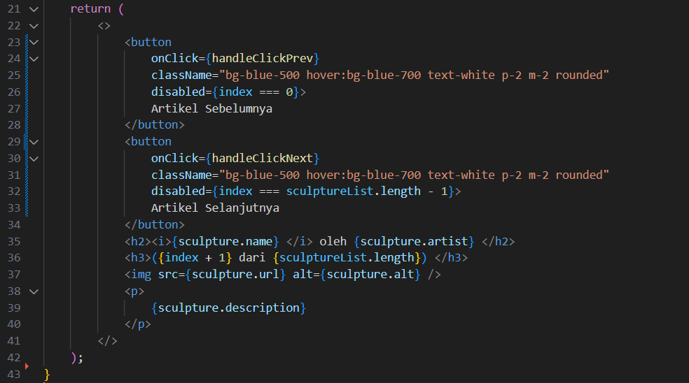

This is a [Next.js](https://nextjs.org/) project bootstrapped with [`create-next-app`](https://github.com/vercel/next.js/tree/canary/packages/create-next-app).

## Getting Started

First, run the development server:

```bash
npm run dev
# or
yarn dev
# or
pnpm dev
# or
bun dev
```

Open [http://localhost:3000](http://localhost:3000) with your browser to see the result.

You can start editing the page by modifying `app/page.tsx`. The page auto-updates as you edit the file.

This project uses [`next/font`](https://nextjs.org/docs/basic-features/font-optimization) to automatically optimize and load Inter, a custom Google Font.
# **Laporan Praktikum**

|  | Pemrograman Berbasis Framework 2024 |
|--|--|
| NIM | 2141720004 |
| Nama | Alya Marliza Koesnanto |
| Kelas | TI - 3A |
| | |


* ## **Jawaban Soal/Praktikum 1**
> **Hasil Langkah 1**


> **Hasil Langkah 2**


* ## **Jawaban Soal/Praktikum 2**

> **Hasil Praktikum 2**


> **Penjelasan:**
Terjadi penambahan tombol atau **_button_**. Yang awalnya hanya ada tombol bertuliskan **"Ini Tombol"** lalu ada tombol tambahan bertuliskan **"Pesan"** dengan cara menambahkan satu komponen _function_ tanpa default dengan menggunakan dua parameter sebagai nilai dinamis untuk tombol tersebut dan memanggil komponen tersebut pada bagian **"page.tsx"** dan memodifikasi kode tersebut agar komponen _function_ dapat digunakan/dipanggil.

* ## **Jawaban Soal/Praktikum 3**

> **Hasil Praktikum 3**
* Tampilan dari **Tombol 3**


* Tampilan dari **Tombol 3 -  Propagation Tombol -1: Child Element**


* Tampilan dari **Tombol 3 -  Propagation Tombol -1: Parent Element**


* Tampilan dari **Tombol 3 -  Propagation Tombol -2: Child Element**


* Tampilan dari **Tombol 3 -  Propagation Tombol -2: Parent Element**


## **Jawaban Soal/Praktikum 4**

> **Hasil Praktikum 4**


## **Jawaban 3 Soal di Praktikum 4**

1. Akan terjadi error, berikut buktinya,


2. Berikut adalah hasil modifikasi dari **gallery.tsx**



3. Berikut penambahan tombol **"Artikel Sebelumnya"**


